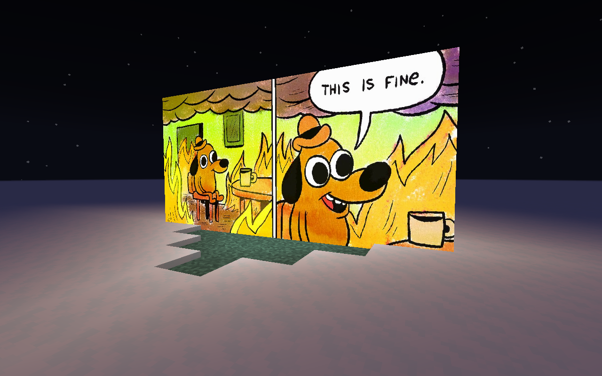
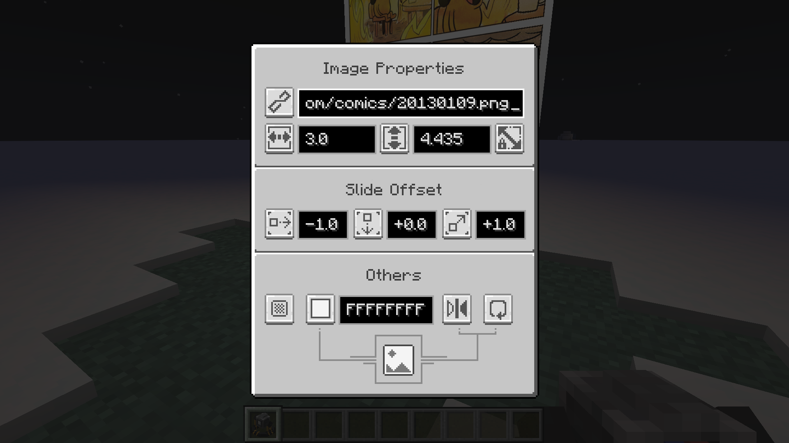

# SlideShow

… is a Minecraft mod that adds a "Slide Show Projector" block. This block can project any online image into the world.

Simply right-click the block to open its GUI, and paste the URL to the image, and then it will work! 
There are also several options to adjust; hover your mouse to these icons to get familiar with these options.

By now, only PNG/JPG/GIF format images are verified as supported (including animations);
other image formats may or may not be supported, and further testing are still needed.

## Development

Simply import this project as a Gradle project to your IDE(s), and wait for your IDE(s) to finish their work.
